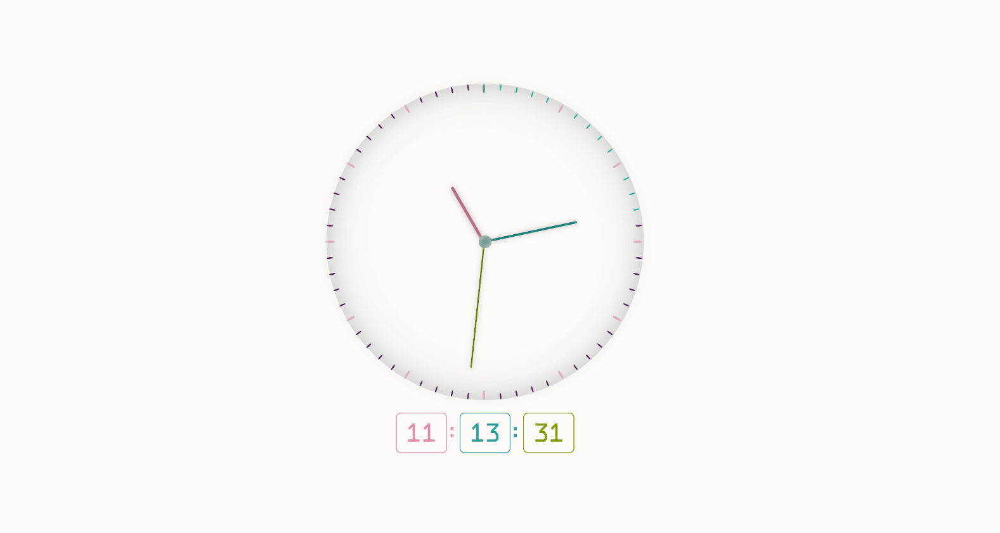

# Analog Clock

Analog clock implemented with HTML, CSS, and JavaScript.

## Screenshots

## Features

*   Display the current time in analog clock format
*   Display the current time below the clock
## Technologies Used

*   HTML
*   CSS
*   JavaScript

## How to Run

1.  Clone the repository: `git clone https://github.com/willem-Aw/AnalogClock.git`
2.  Open `index.html` in your browser.
### OR

Click this link:

[https://willem-Aw.github.io/AnalogClock/](https://willem-Aw.github.io/AnalogClock/)